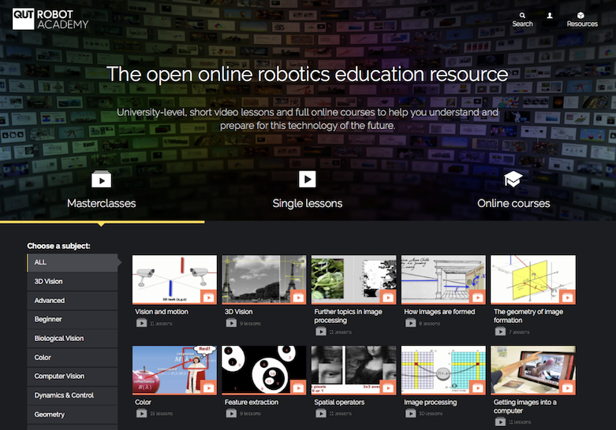

The Robot Academy is free teaching resource for robotics and computer vision.  It contains over 200 short (less than 8 minute) lessons that are pitched at undergraduate engineering level.  However, much of the material is accessible to a general audience and the difficulty of each lesson is indicated.

## Quick history
These videos were created in 2015 as part of two QUT MOOCs but since 2017 they are available in an anytime anywhere any-order format.  The search bar lets you search for topics and easily navigate to related topics.  

The companion textbook was _Robotics, Vision & Control: fundamental algorithms in MATLAB, first edition (2011) by Peter Corke_ which used MATLAB® to illustrate principles through screen casts.  MATLAB is a proprietary language, you require a licence to use it, and was used in conjunction with two open-source toolboxes:

- Robotics Toolbox for MATLAB v9
- Machine Vision Toolbox for MATLAB v3

# Changes in the software environment

Software continues to evolve, and atrophy, and this has implications for the screencasts embedded in the robot academy.

## The changes

### Open-source MATLAB Toolboxes

These toolboxes were updated in 2017 for _Robotics, Vision & Control: fundamental algorithms in MATLAB, second edition (2017) by Peter Corke_

- Robotics Toolbox for MATLAB v10
- Machine Vision Toolbox for MATLAB v4
- Spatial Math Toolbox for MATLAB v1

and this necessitates minor changes to the screencast examples.  Note that the Spatial Math Toolbox was factored out of both Toolboxes and is part of their installation packages.

These open source toolboxes were written in the early 1990s and are no longer being actively maintained. They remain free and openly available on GitHib.

### Closed-source MATLAB Toolboxes

The MathWorks®, publishers of MATLAB, have developed their own toolboxes that cover this same functionality and more, albeit with quite different syntax, and these are used in _Robotics, Vision & Control: fundamental algorithms in MATLAB, third edition (2023) by Peter Corke, Witold Jachimczyk, and Remo Pillat_.

### Open-source Python Toolboxes

Finally, the MATLAB toolboxes were ported to Python over the period 2020-22, and led to an alternative third edition of the book _Robotics, Vision & Control: fundamental algorithms in Python, third edition (2023) by Peter Corke_.

## Dealing with the changes

To accomodate these changes the Robot Academy user interface has been modified to include a `Code transcript` tab beneath the video window.  That tab expands into four further tabs that provide the code under discussion in four different forms:

1.  `RVC1` the code that is shown in the video, which corresponds to the first edition of the book.
2.  `RVC2` the code that is shown in the video with minor modifications to correspond with the second edition of the book.
3.  `Mathworks` the code has been modified to work with the current MathWorks Toolboxes for robotics and vision (which require a licence). This matches the third edition of the book in MATLAB, and provides a fully-supported software environment with target code generation capability.
4. `Python` the code has been translated to Python and makes use of the open-source Python toolboxes.  This matches the third edition of the book in Python, and provides an all open-source solution.

